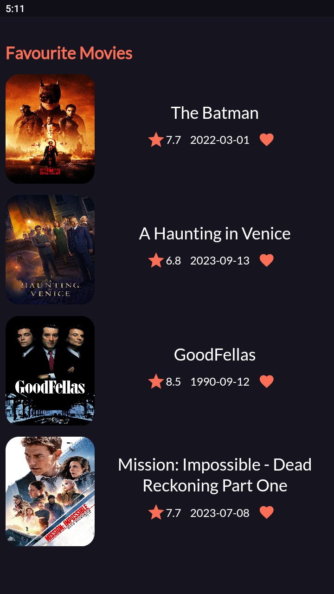

# MovieVerse

 A Movie Recommendation App using Flutter and TMDB Api.

# Technology used:
- Navigation: go_router
- State management: Cubit
- Responsive Mobile Ui: flutter_screenutil
- Auth:FireBase Auth
- Local DataBase: Hive

## ScreenShots

| Dark                             | Light                              |
| --------------------------------- | --------------------------------- |
|   |   |
|   |   |
|   |   |
|   |   |
|   |  |
|  |  |
|  |  |
|  | |
